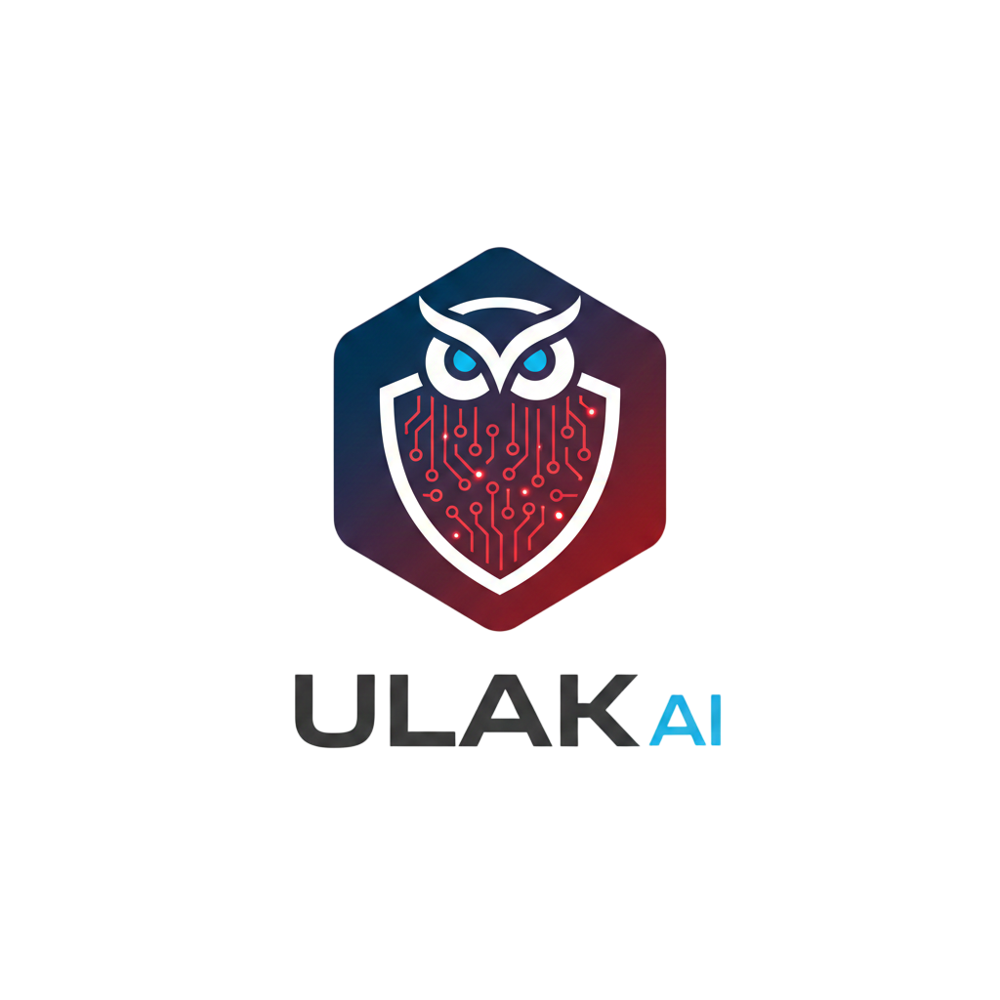

<div align="center">
  
  <h1>ULAK AI</h1>
  <p><b>Next-Gen eBPF-Powered Threat Detection & Local AI Diagnostic Engine</b></p>

  [](https://github.com/erogluyusuf/ulak)
  [](#)
  [](LICENSE)
  <br>
  
  
  
  
</div>

---

##  About ULAK
**Ulak** (Turkish for *Messenger*) is a high-performance, AI-driven Endpoint Detection and Response (EDR) prototype. Unlike traditional log parsers, Ulak operates at the **Kernel level** using **eBPF** (Extended Berkeley Packet Filter) to intercept system calls in real-time. 

Captured anomalies are analyzed by a **Local LLM** (Large Language Model) to generate **5W1H** diagnostic reports, providing not just raw data, but actionable intelligence and automated remediation capabilities.

---

##  Key Features
** eBPF Real-Time Sensing:** Low-overhead kernel monitoring using C probes to detect reverse shells, unauthorized access, and network anomalies.
** Local AI Diagnostics:** Privacy-first analysis using local LLMs (Ollama) to interpret complex system errors into human-readable 5W1H reports.
** Interactive SOC Dashboard:** A modern, mobile-responsive web interface built with Vue 3 and Tailwind CSS for centralized monitoring.
** Interactive Mascot Notifications:** Real-time desktop alerts with active "Remediate" and "Dismiss" actions that bypass root barriers.
** Automated Remediation:** One-click execution of AI-suggested fixes (Process termination, service restarts) directly from the dashboard or desktop.

---

## Preview
<div align="center">
  
  <p><i>The ULAK AI SOC Interface: Real-time incident streaming and diagnostic analysis.</i></p>
</div>

---

## Project Structure
```text
.
├── config                 # Rule definitions and system settings
│   ├── rules.json         # Pattern matching and automated action rules
│   └── settings.yaml      # AI and Network configurations
├── src
│   ├── ebpf               # Kernel-space C probes and Python handlers
│   │   ├── probe.c        # eBPF C code for syscall hooking
│   │   └── handler.py     # Userspace bridge for eBPF data
│   ├── analyzer           # AI Engine and LLM integration
│   ├── dashboard          # FastAPI Backend & Vue.js Frontend
│   │   ├── app.py         # Main API Gateway & Notification Manager
│   │   └── frontend       # Responsive SOC Dashboard
│   └── main.py            # Orchestrator for the entire system
├── setup.sh               # Dependency installer and environment setup
└── requirements.txt       # Python dependencies
```
## Quick Start

### Prerequisites
- **OS:** Linux (Kernel 5.15+ recommended, tested on Fedora)
- **Tools:** `bcc-tools`, `python3.14+`, `Ollama`
- **Permissions:** Root access required for eBPF syscall hooking.

### Installation
1. **Clone the repository:**
   ```bash
   git clone [https://github.com/erogluyusuf/ulak.git](https://github.com/erogluyusuf/ulak.git)
   cd ulak
   ```

2. **Run the setup script:**
3.  ```bash
    chmod +x setup.sh
    ./setup.sh
   ```

4. **Start the ULAK Services:**
```bash
    # Terminal 1: Start the AI Dashboard
    sudo python3 src/dashboard/app.py
  
    # Terminal 2: Start the eBPF Sensor
    sudo python3 src/ebpf/handler.py
```
3. **Start the ULAK Services:** ``` Open http://localhost:8000``` in your browser.
## How it Works

### Detection  
The eBPF probe hooks into critical kernel functions (e.g., `tcp_connect`, `execve`) to monitor system-level activity in real time.

### Streaming  
When a pattern matches a rule defined in `rules.json`, the handler streams telemetry data to the FastAPI backend.

### Analysis  
The collected context is sent to a local LLM, which generates a structured root-cause analysis using the **5W1H** methodology (Who, What, When, Where, Why, How).

### Response  
The user is notified via:
- An interactive desktop mascot, or  
- The web dashboard  

The user can then approve a **"Remediate"** action (e.g., `kill -9`) directly from the interface.

---

## License

Distributed under the MIT License. See `LICENSE` for more information.

---

## Contact

**Yusuf Eroğlu**  
GitHub: https://github.com/erogluyusuf  

Project Link: https://github.com/erogluyusuf/ulak